# UniAct Core System

**UniAct Core System** is the central university management backend for the UniAct ecosystem: a unified, multi-platform university action system with AI-powered academic assistance. This repository represents the core operational system that supports university onboarding, tenant-level administration, academic setup, student and staff accounts, enrollment, attendance, learning groups, transcripts, announcements, analytics, and integration with the wider UniAct client applications.

UniAct is designed for universities that need a single dependable foundation for academic administration and student-facing digital services. It connects the work of platform owners, university administrators, staff, faculty members, teaching assistants, and students into one coordinated workflow.

  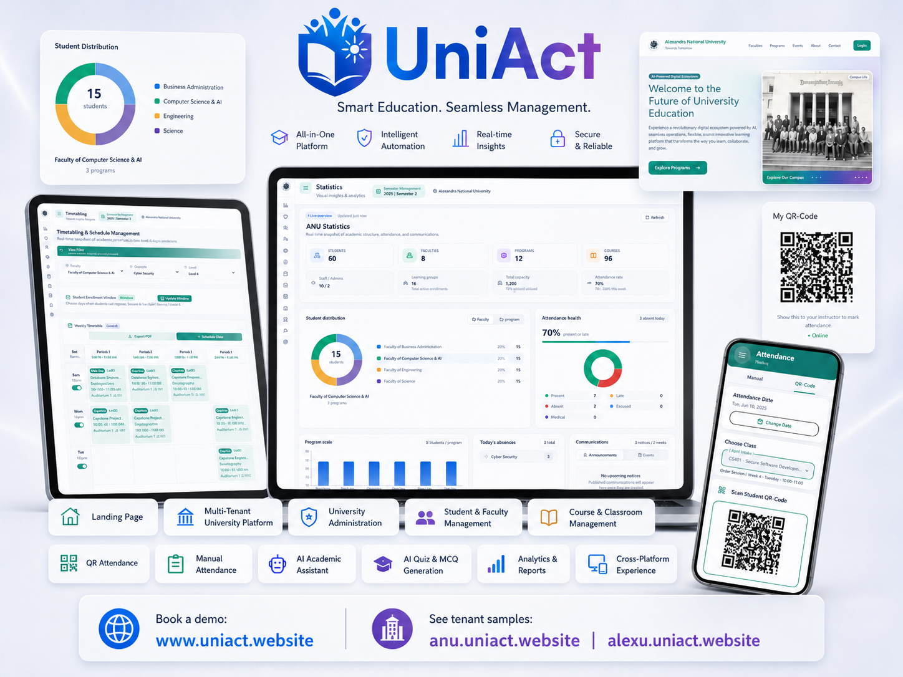

  

## Table of Contents

- [Project Summary](#project-summary)
- [Problem Statement](#problem-statement)
- [Motivation](#motivation)
- [Target Users](#target-users)
- [Main Goals](#main-goals)
- [Repository Scope](#repository-scope)
- [Major Features](#major-features)
  - [Multi-University Platform Management](#multi-university-platform-management)
  - [University Branding and Public Profile](#university-branding-and-public-profile)
  - [Identity, Authentication, and Account Lifecycle](#identity-authentication-and-account-lifecycle)
  - [Role-Based Permissions](#role-based-permissions)
  - [Faculty and Academic Regulation Management](#faculty-and-academic-regulation-management)
  - [Program Management](#program-management)
  - [Course and Prerequisite Management](#course-and-prerequisite-management)
  - [Semester Management](#semester-management)
  - [Classroom and Resource Management](#classroom-and-resource-management)
  - [Student Management](#student-management)
  - [Staff Management](#staff-management)
  - [Scheduling](#scheduling)
  - [Enrollment Windows](#enrollment-windows)
  - [Student Course Enrollment](#student-course-enrollment)
  - [Administrative Enrollment Management](#administrative-enrollment-management)
  - [Learning Groups](#learning-groups)
  - [Attendance Management](#attendance-management)
  - [Course Assessments and Grades](#course-assessments-and-grades)
  - [Transcript Generation](#transcript-generation)
  - [Announcements and Events](#announcements-and-events)
  - [Dashboards and Analytics](#dashboards-and-analytics)
  - [AI-Powered Academic Assistant Integration](#ai-powered-academic-assistant-integration)
  - [Background Jobs and Status Tracking](#background-jobs-and-status-tracking)
  - [File and Media Handling](#file-and-media-handling)
- [System Workflow](#system-workflow)
- [Conceptual Modules and Interactions](#conceptual-modules-and-interactions)
- [Business Logic and Real-World Scenarios](#business-logic-and-real-world-scenarios)
- [User Experience and Application Flow](#user-experience-and-application-flow)
- [Roles and Permissions](#roles-and-permissions)
- [Notifications, Reports, and Automation](#notifications-reports-and-automation)
- [External Integrations](#external-integrations)
- [Quality Goals](#quality-goals)
- [Screenshots](#screenshots)
- [Conclusion](#conclusion)

## Project Summary

UniAct Core System provides the operational backbone for a modern university digital platform. It enables each university to manage its own academic data and workflows while remaining part of a broader platform that can host multiple universities.

From a user's point of view, UniAct supports the full academic cycle:

- A platform owner creates and activates universities.
- Each university configures its faculties, programs, semesters, courses, fees, classrooms, roles, and staff.
- Student affairs teams create or import student accounts.
- Students register for classes during configured enrollment windows.
- Staff manage teaching groups, attendance, assessments, and grades.
- Students access schedules, learning groups, academic materials, attendance status, transcripts, and AI study tools.
- Administrators monitor operational analytics, announcements, attendance activity, and background job results.

## Problem Statement

Universities often rely on disconnected tools for student records, scheduling, enrollment, attendance, communication, academic results, and learning materials. This creates repeated data entry, inconsistent records, slow administrative workflows, limited visibility, and a fragmented experience for students and staff.

The problem becomes harder when a platform must support multiple universities, each with its own academic rules, branding, users, data, programs, and operational policies.

UniAct addresses this by providing one core system that organizes university operations around tenant isolation, role-based access, academic rules, background processing, and cross-platform client support.

## Motivation

The motivation behind UniAct is to make university life easier to manage and easier to experience. Instead of treating academic administration, student services, learning groups, attendance, and AI assistance as separate tools, UniAct brings them into one ecosystem.

The project is especially motivated by the need for:

- Faster university onboarding.
- Clear separation between different universities.
- Better academic workflow automation.
- Reliable student registration during high-traffic enrollment periods.
- Stronger student and staff visibility into schedules, attendance, grades, and transcripts.
- AI-supported learning experiences grounded in actual course materials.

## Target Users

UniAct serves several user groups:

- **Platform owners and super administrators** who manage the overall UniAct platform and onboard universities.
- **University root accounts and administrators** who configure university-specific operations.
- **Student affairs teams** who manage students, bulk imports, activation, academic status, and enrollment support.
- **Academic administrators** who manage faculties, programs, courses, semesters, classrooms, and academic rules.
- **Faculty members, teaching assistants, and staff** who manage classes, learning groups, attendance, assessments, and grades.
- **Students** who access schedules, enroll in courses, join learning groups, track attendance, view transcripts, and use AI study tools.
- **Client application teams** building web, mobile, or desktop experiences on top of the core system.

## Main Goals

The main goals of the project are:

- Provide a unified operational foundation for university administration.
- Support multiple universities while keeping each university's data and configuration separate.
- Model real academic structures such as faculties, programs, levels, courses, semesters, classrooms, and credit-hour rules.
- Make course enrollment reliable, fair, and responsive under concurrent student demand.
- Improve communication between students and staff through course-based learning groups and announcements.
- Support attendance tracking and mobile-friendly academic experiences.
- Generate transcripts and academic results according to configurable grading rules.
- Integrate AI academic assistance with course materials and student context.
- Keep long-running operations responsive through background processing and job tracking.

## Repository Scope

The broader UniAct project includes multiple subprojects described in the project report, including client applications and the AI educational engine. This repository focuses on the **core system**: the central service that coordinates university data, academic workflows, access control, automation, and integration points used by the wider ecosystem.

It is not a marketing site or standalone user interface. It is the product foundation that enables the web, mobile, desktop, and AI-facing parts of UniAct to operate consistently.

## Major Features

### Multi-University Platform Management

UniAct supports a multi-university operating model. A platform-level administrator can create universities, activate or deactivate them, view university records, and remove a university when needed.

From the user's point of view, this means UniAct can host many institutions under one platform while allowing each university to behave like its own separate workspace. A university must be active before its users can access tenant-specific features.

When a university is created, the system prepares an isolated workspace for that university and creates the foundation needed for its academic data, files, settings, and users.

#### ANU Tenant

  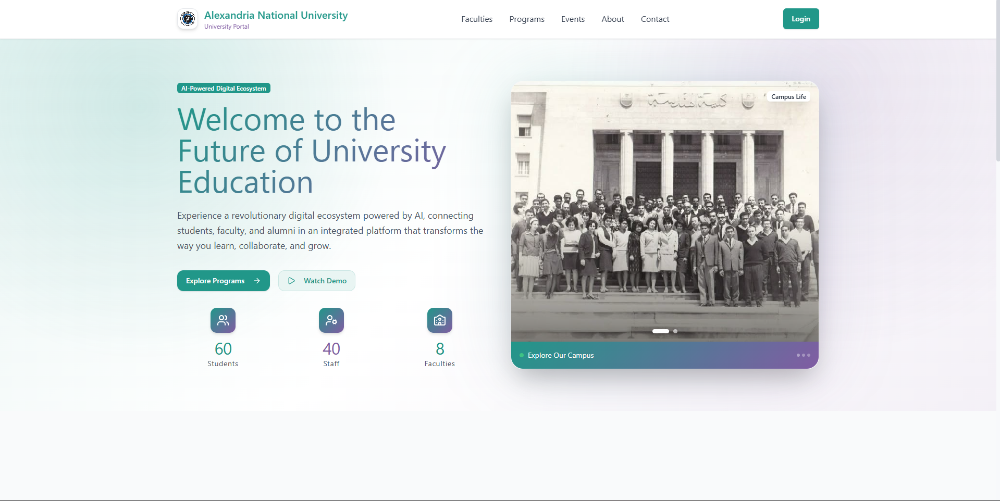

  

#### ALEXU Tenant

  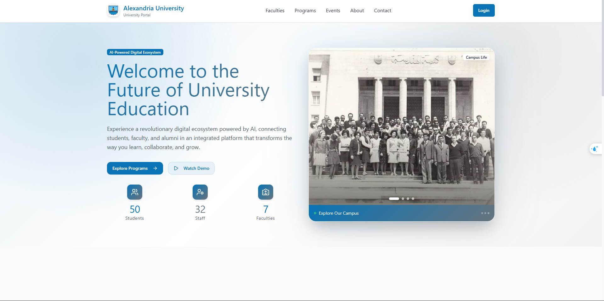

  

### University Branding and Public Profile

Each university can maintain its own public identity inside the UniAct ecosystem. The system supports public university listing, public profile data, basic public statistics, visual branding settings, logo upload, and campus hero images.

Administrators can customize colors, tab naming, logos, and hero images so that client applications can present a university-specific experience rather than a generic platform interface.

  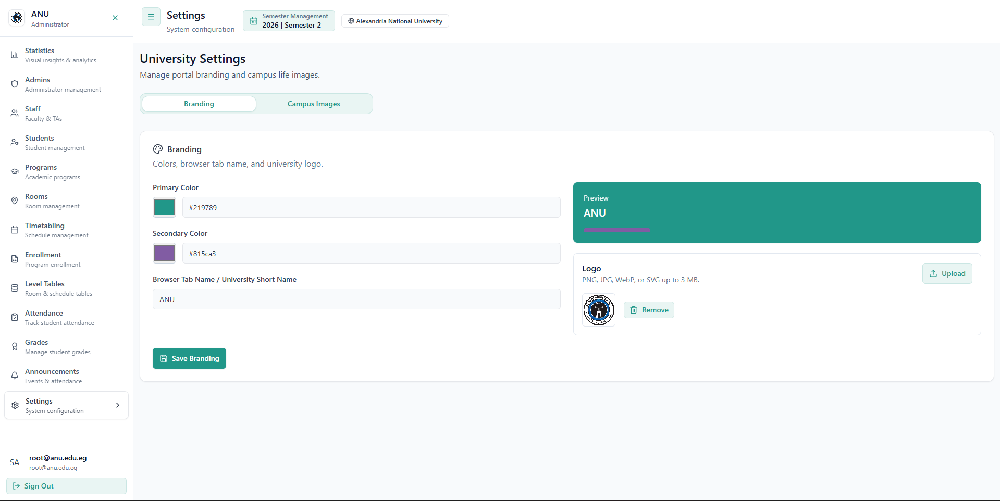

  

  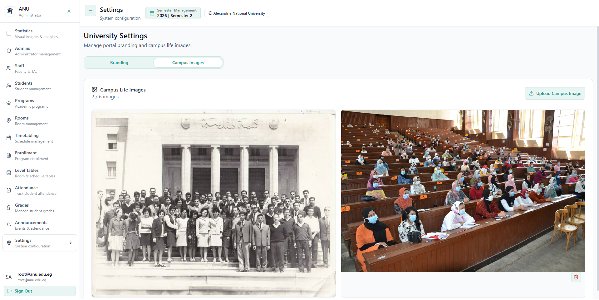

  

### Identity, Authentication, and Account Lifecycle

UniAct supports secure account access for platform administrators, university staff, and students. Users sign in under a specific university context, and their roles, permissions, university, staff/student identity, semester, program, and academic level are reflected in their experience.

The system supports:

- Platform administrator login and verification.
- University user login.
- Root account assignment for a university.
- Staff account creation and email verification.
- Student account creation and activation.
- Current-user profile viewing and updating.
- Password changes with current-password validation.
- Account blocking states for restricted access.

For users, this means the application experience adapts to who they are: a student sees student workflows, a staff member sees teaching workflows, and administrators see management tools.

### Role-Based Permissions

UniAct includes role-based access control for university tenants. Administrators can create roles, assign permissions to roles, and assign roles to users.

The permission model covers key administrative areas such as:

- Role management.
- Account management.
- Faculty management.
- Program management.
- Course management.
- Course assessment management.
- Semester management.
- Classroom management.
- Student schedule enrollment.

This allows universities to apply least-privilege access in practical ways. For example, a staff member may be allowed to manage grades for assigned courses without having full university administration permissions.

  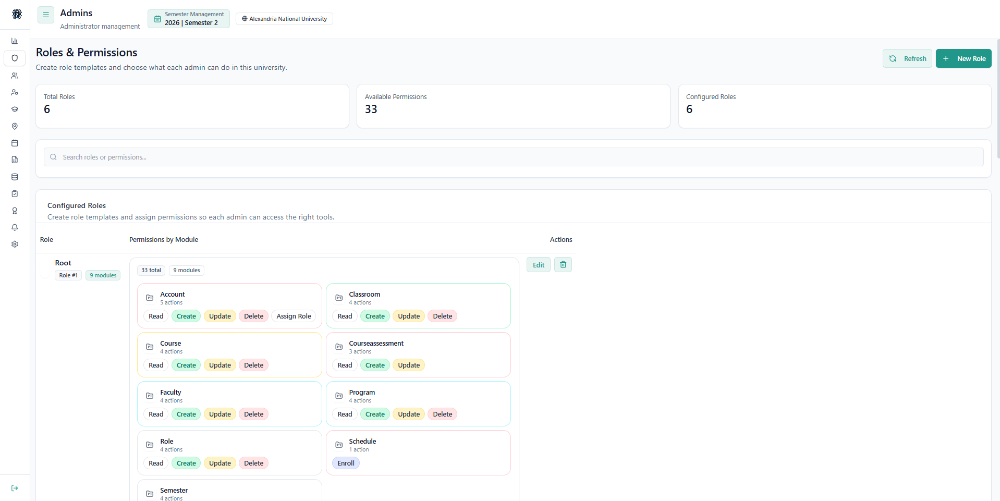

  

### Faculty and Academic Regulation Management

Universities can create faculties and attach academic regulations to them. A faculty can have a dean, description, establishment date, and one or more regulations.

Faculty regulations support real academic policy concerns such as:

- Grade thresholds.
- Absence limits.
- Rounding or approximation rules.
- Mercy-rule behavior for borderline grades.

These regulations are later used by academic workflows such as transcript generation and result calculation.

  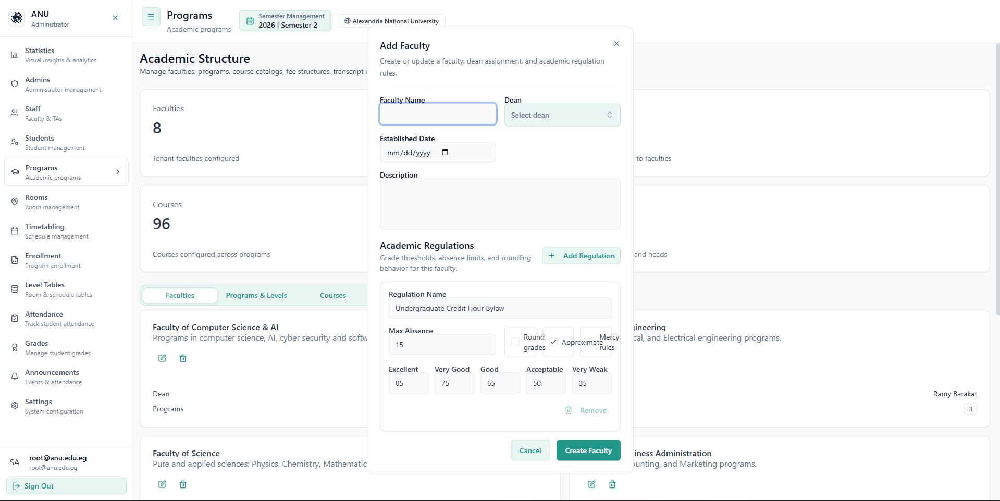

  

### Program Management

Programs define the academic structure students follow inside a faculty. UniAct supports program creation and update with academic levels, credit requirements, fee structures, transcript grade definitions, and academic load rules.

From an administrator's point of view, a program can describe:

- Program type, such as bachelor, diploma, master, or PhD.
- Program head and contact details.
- Required university, faculty, and program credit hours.
- Program levels and their credit ranges.
- Semester-specific and summer fee structures.
- Grade-to-GPA transcript definitions.
- Academic load rules based on semester and GPA.
- Result display preference.

These rules influence enrollment, transcript generation, academic progress, and student dashboard data.

  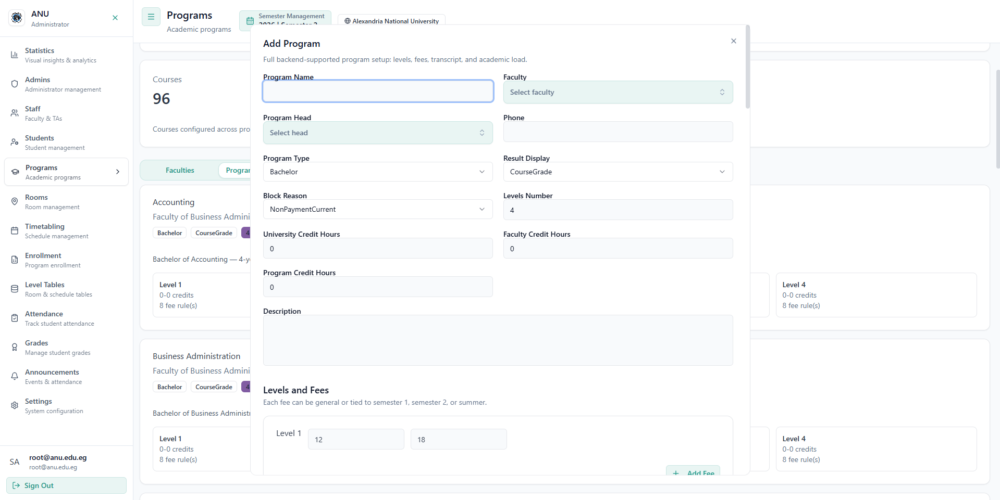

  

### Course and Prerequisite Management

UniAct allows universities to define courses and connect them to programs and academic levels. Courses can include credit hours, descriptions, syllabi, course type, success thresholds, final-exam requirements, and prerequisites.

Students benefit from this because enrollment can respect prerequisite rules and prevent registration in courses that should not yet be available. Staff benefit because courses can later be connected to schedules, assessments, grades, learning groups, and attendance sessions.

  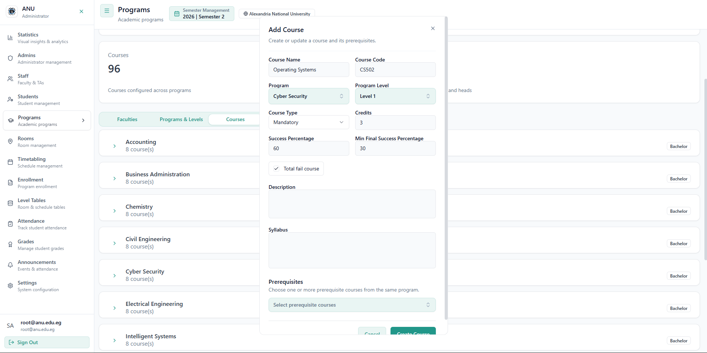

  

### Semester Management

Semesters represent the academic time periods in which schedules, enrollments, attendance, assessments, and transcripts occur.

Administrators can define academic year, term, start date, end date, and semester type. The system prevents duplicate semester definitions and date conflicts, helping universities maintain a clean academic calendar.

The current active semester is important throughout the system: it drives student login context, schedule visibility, staff course lists, attendance dashboards, learning groups, and transcript workflows.

  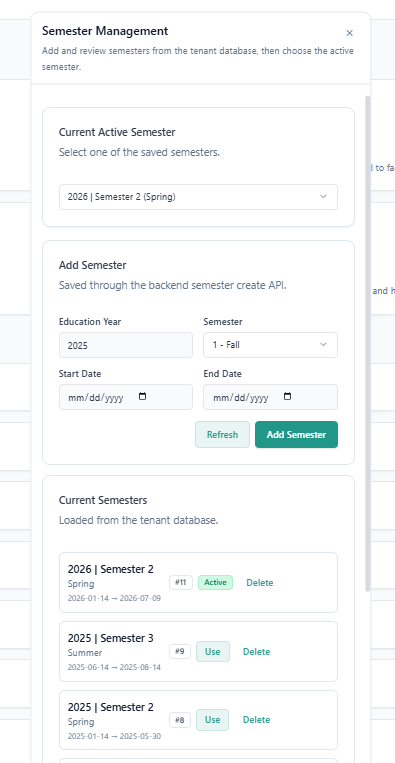

  

### Classroom and Resource Management

UniAct supports classroom records with building, room number, capacity, and room type. These records are used during schedule planning and enrollment capacity management.

For administrators, this helps prevent unrealistic scheduling decisions. For students, it ensures schedule views include classroom locations and capacity-driven seat availability.

  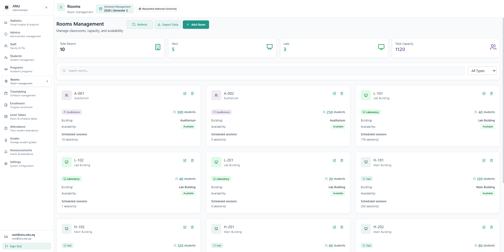

  

### Student Management

Student affairs teams can create individual student accounts, update student records, activate accounts, delete student records, and search or filter student lists.

Student records include academic placement information such as program, program level, university student ID, status, CGPA, enrollment date, and personal profile data.

UniAct also supports bulk student import from Excel files. Instead of forcing administrators to wait while a large import finishes, the system accepts the file, processes it in the background, validates rows, detects duplicates, creates valid student accounts, assigns the student role, associates fee records, and records detailed import results.

  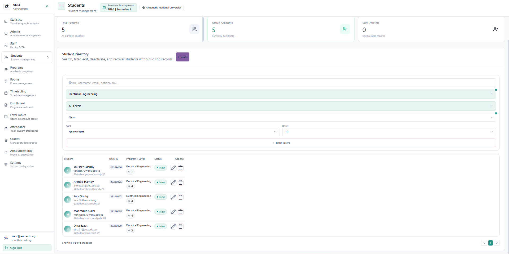

  

#### View Personal Student Information

  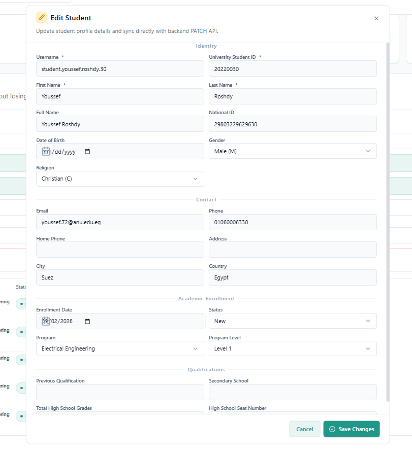

  

### Staff Management

Administrators can create, verify, update, list, and delete staff accounts. Staff accounts can be assigned roles during creation, allowing the university to control what each staff member can do from the beginning.

Staff accounts are used for teaching assignments, course access, attendance sessions, program leadership, faculty dean assignment, learning group ownership, assessment management, and grade entry.

  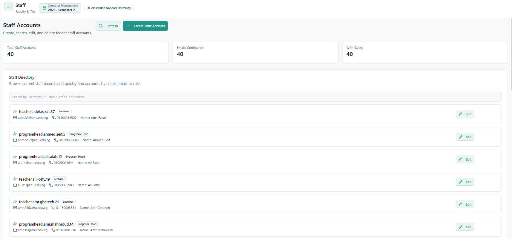

  

### Scheduling

Scheduling connects courses, staff, classrooms, days, times, academic levels, programs, and semesters.

Administrators can build and save schedules for a program and level. The system checks for conflicts such as overlapping sessions for the same teacher or double-booked classrooms. It also supports shared classes where the same physical class can serve more than one program context when the course and session type match.

When schedule slots are created or updated, UniAct automatically coordinates related learning groups so that course communication spaces reflect the current teaching assignments.

Students see schedule information differently from administrators. A student view focuses on the relevant schedule and enrollment state, while an administrator view includes additional lookup information needed for planning.

  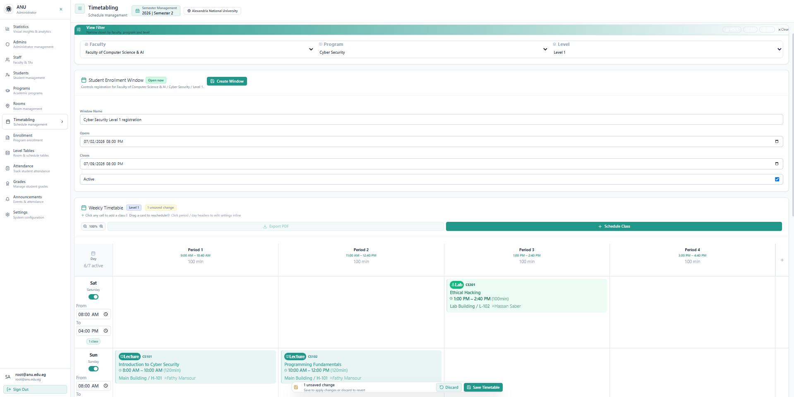

  

### Enrollment Windows

Enrollment windows control when students are allowed to register for courses. A university can configure windows by faculty, semester, program level, and optionally by program.

From the student's point of view, course registration is only available when the relevant registration window is open. From the administrator's point of view, this enables phased registration by faculty, level, or program without opening enrollment to everyone at once.

  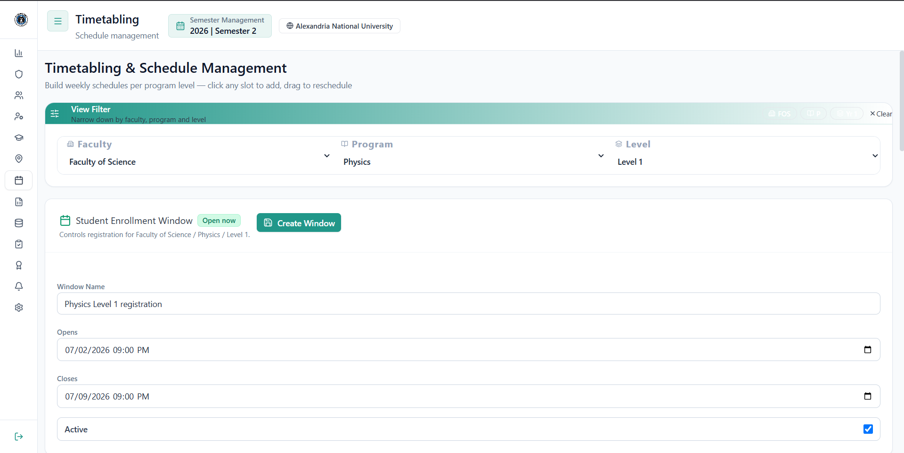

 

### Student Course Enrollment

Student enrollment is one of the central workflows in UniAct. Students submit selected schedule slots for the current semester, and the system processes the registration in the background.

The enrollment workflow supports:

- Current-semester registration.
- Enrollment-window enforcement.
- Program and level matching.
- Prerequisite validation.
- Prevention of already-passed course registration.
- Credit-hour validation using semester and GPA-based academic load rules.
- Course drop and add behavior based on the student's submitted selections.
- Seat-capacity checks.
- Protection against overbooking when many students enroll at once.
- Per-course success, drop, or failure results.
- Automatic learning group membership updates.
- Real-time remaining-seat updates for connected clients.

For students, this means enrollment can remain responsive even during peak demand, while still producing clear outcomes for each selected course.

#### A Student Who Is Not Yet Allowed To Enroll

  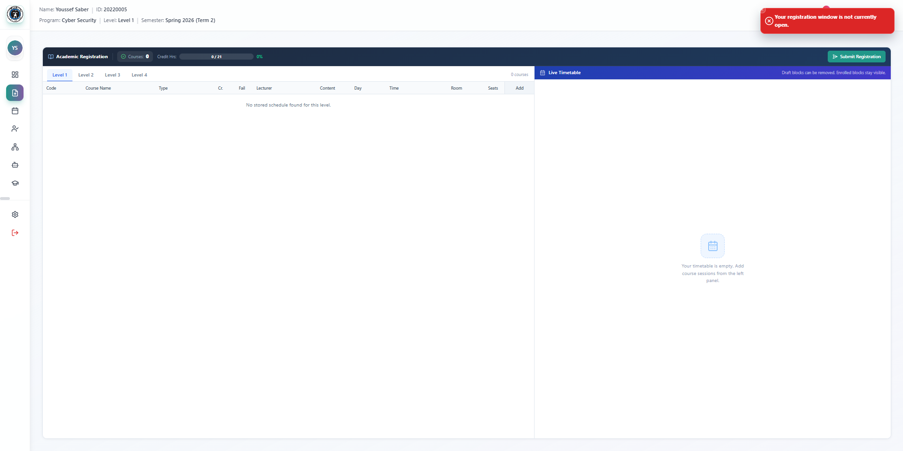

  

#### A Student Who Was Allowed To Enroll

  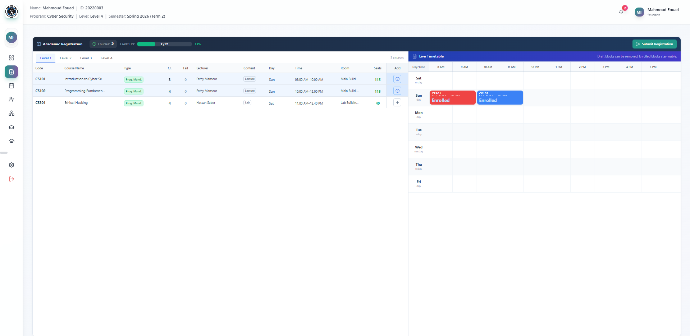

  

### Administrative Enrollment Management

Administrators can manage student enrollments directly when student affairs intervention is needed. This supports listing enrollments, filtering by student, course, status, or semester, viewing a student's enrollment track, seeing available slots for a student, creating enrollments, changing enrollment status, moving a student to another slot, or deleting an enrollment.

This feature supports real-world cases such as correcting registration mistakes, handling special approvals, assisting blocked or confused students, and resolving schedule changes after registration.

### Learning Groups

Learning groups are course-based communication spaces for students and staff. They are automatically created from schedule activity and are connected to a course and semester.

Users can:

- View their learning groups for the current semester.
- View group details and members.
- Join a group using an access code.
- Create posts with content, type, due date, and attachments.
- Filter posts by type.
- Update and delete posts.
- Pin important posts.
- Comment on posts.
- Delete comments when authorized.

Learning group post types include announcements, assignments, and materials. Group owners can moderate posts and comments, while student posting can be controlled at the group level.

  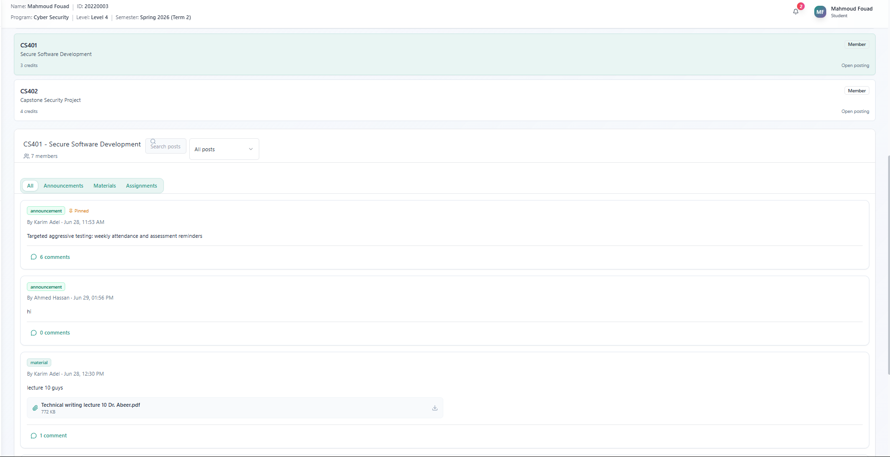

  

### Attendance Management

UniAct supports attendance workflows for staff and students. Staff can create attendance sessions for scheduled classes, view enrolled students, record attendance, and scan student QR payloads. Students can view attendance status and mobile-friendly schedule data.

Attendance supports multiple attendance modes conceptually, including manual, QR code, biometric, geofencing, hotspot, and online modes. The implemented workflows include manual record updates and QR-based scanning.

The attendance experience includes:

- Course summaries for administrators or assigned staff.
- Course options for attendance workflows.
- Attendance session creation and lookup.
- Enrolled student lists by slot or course.
- Student attendance updates.
- Mobile dashboard data for students and staff.
- Student timetable views.
- Student attendance timeline and QR payload generation.
- QR scan validation to ensure the scanned student is actually enrolled in the class.

#### Student Can View Its Attendance History

  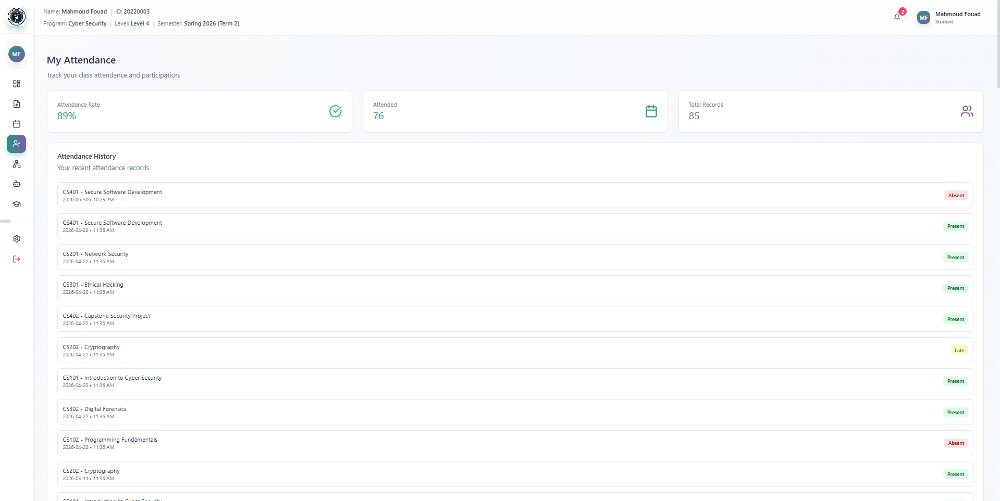

#### Staff Can Take Attendance

  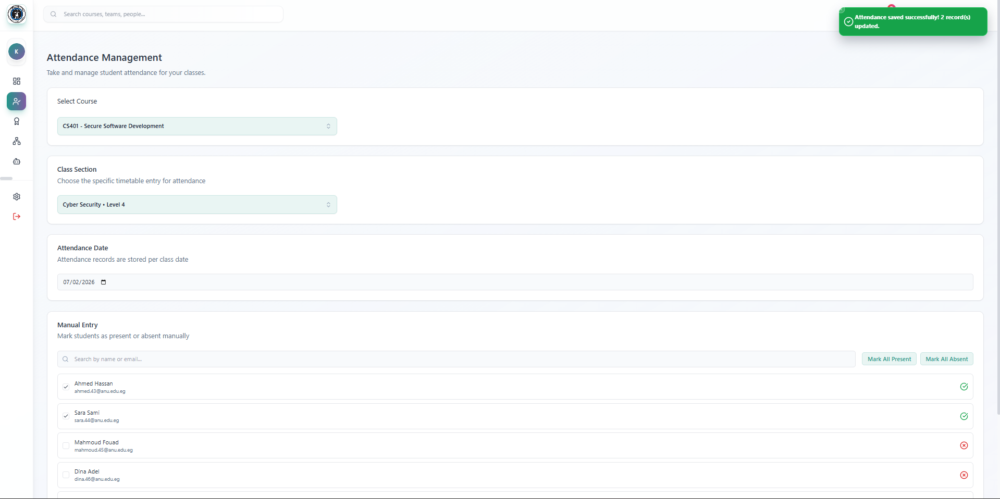

### Course Assessments and Grades

Staff can manage course assessments for their assigned courses, while authorized administrators can oversee assessment workflows more broadly.

UniAct supports:

- Creating assessment columns for a course in the current semester.
- Assigning multiple assessments.
- Preventing duplicate assessment labels.
- Automatically preparing grade records for enrolled students.
- Viewing course assessments.
- Updating assessment labels, types, and marks.
- Deleting assessment columns.
- Listing students registered in a course.
- Updating student marks while preventing marks from exceeding assessment limits.

This supports practical grading workflows such as quizzes, assignments, midterms, finals, and projects.

  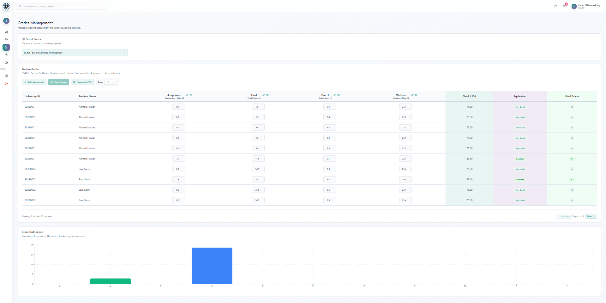

### Transcript Generation

UniAct can generate student transcripts for a selected semester, all semesters for one student, or a faculty-wide semester batch.

Transcript generation applies configured academic logic:

- Course assessment marks are converted into score percentages.
- Faculty regulations can round or approximate scores.
- Mercy rules can adjust eligible borderline scores.
- Course success thresholds determine pass/fail status.
- Final assessment requirements can determine total failure when configured.
- Program transcript definitions map scores to grade letters and GPA ranges.
- Semester GPA and cumulative GPA are calculated from completed course results.

Large transcript generation can run as a background job so administrators can request a batch and later inspect its completion status, including partial failures.

  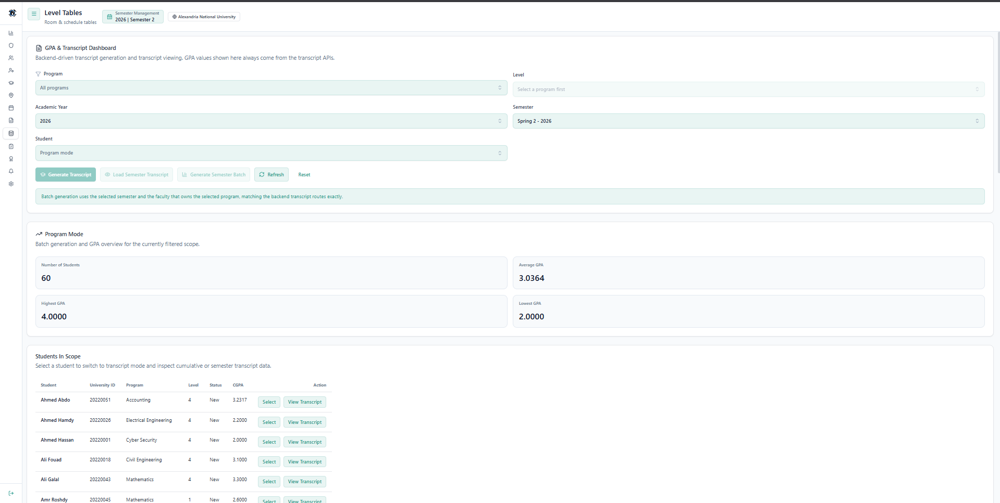

  

  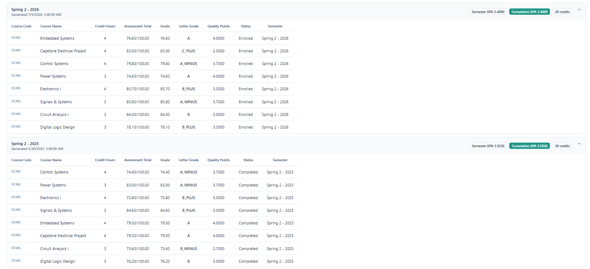

  

#### Generate Transcript For Specific Faculty

  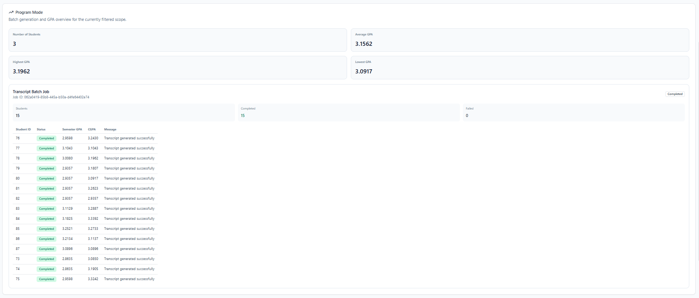

  

### Announcements and Events

UniAct supports announcement and event publishing for university communication. Announcements can be public or managed internally, can target different audiences, and can include event dates and locations.

This allows a university to communicate news, student notices, academic reminders, and upcoming events through the connected applications.

### Dashboards and Analytics

UniAct includes dashboard-oriented data for institutional visibility.

University analytics include:

- Counts for students, staff, administrators, faculties, programs, courses, classrooms, learning groups, active registrations, and attendance sessions.
- Classroom capacity and maintenance-related resource data.
- Communication counts for announcements and events.
- Attendance status distribution over the last 30 days.
- Faculty and program breakdowns.
- Today's absences by program and level.
- Upcoming announcements and events.

Mobile dashboard data is also role-sensitive. Students can see schedule and credit-progress information, while staff can see teaching-related daily schedule and statistics.

#### Admin Dashboard View

  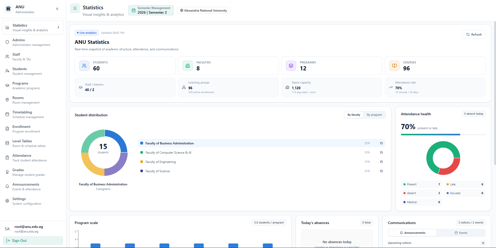

  

#### Staff Dashboard View

  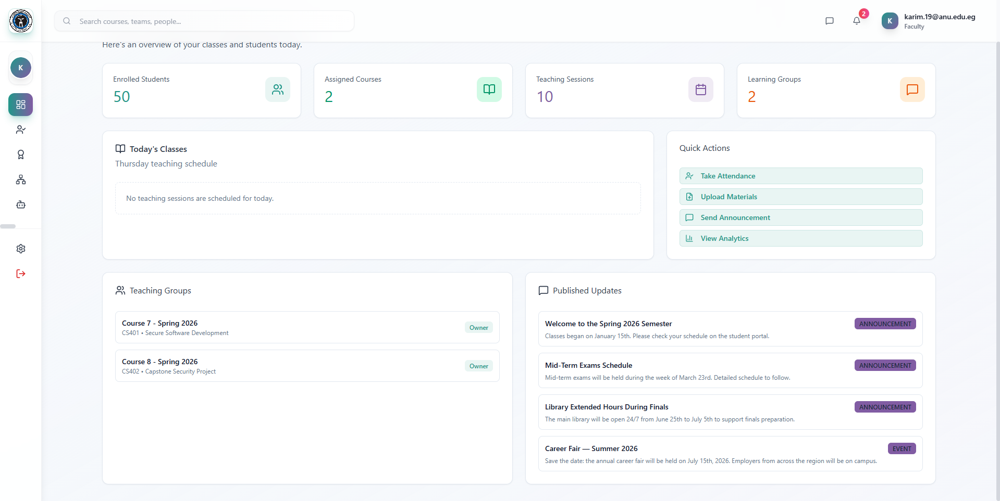

  

### AI-Powered Academic Assistant Integration

UniAct integrates with an external AI educational engine at a high level. The core system connects learning group materials with AI-powered study workflows.

The AI-assisted experience includes:

- Syncing supported learning group materials for AI indexing.
- Listing indexed files and extracted chapters.
- Searching course materials.
- Creating and listing AI chat sessions.
- Chatting with an assistant grounded in course materials.
- Optionally including student transcript context in assistant conversations.
- Summarizing study content.
- Generating exam-style questions.
- Producing mind maps.
- Saving and retrieving study notes and bookmarks for files.

This feature is scoped around learning groups, so AI assistance remains connected to the student's actual course context instead of acting as a generic chatbot.

### Background Jobs and Status Tracking

UniAct uses background processing for operations that may take time or involve many records.

Tracked job workflows include:

- Bulk student import.
- Student enrollment.
- Transcript generation.

Users and administrators can check job status and see results after processing. This keeps the interactive application responsive while still supporting heavy workflows such as thousands of imported students or faculty-wide transcript generation.

### File and Media Handling

UniAct handles several types of files and media:

- Student import spreadsheets.
- University logos and campus images.
- Learning group post attachments.
- Course materials used by AI study workflows.
- Secure retrieval of stored files by client applications.

File handling is used as a product capability rather than a standalone document management system. Its purpose is to support university branding, academic collaboration, bulk operations, and AI-assisted study.

## System Workflow

A typical UniAct lifecycle looks like this:

1. **Platform setup**: A super administrator creates a university, activates it, and assigns the university's root account.
2. **University configuration**: The root or authorized administrators configure branding, roles, permissions, faculties, regulations, programs, levels, fees, semesters, courses, classrooms, and staff.
3. **Student onboarding**: Student affairs creates students individually or imports them in bulk. Student accounts are validated, assigned roles, and activated when ready.
4. **Schedule planning**: Administrators build schedules by program, level, semester, course, teacher, classroom, and time. Conflict checks help maintain realistic schedules.
5. **Enrollment preparation**: Administrators configure enrollment windows for the relevant faculty, program, level, and semester.
6. **Student enrollment**: Students view available schedules during their open window and submit course selections. The system validates rules, reserves seats, updates learning group memberships, and reports per-slot outcomes.
7. **Teaching operations**: Staff manage learning group posts, course materials, attendance sessions, assessments, and grades.
8. **Academic records**: Transcript generation converts grades into academic results using the university's configured regulations and program grade definitions.
9. **Communication and visibility**: Announcements, events, dashboards, attendance summaries, job statuses, and analytics keep users informed.
10. **AI-supported study**: Learning group materials can be synchronized with the AI assistant so students can search, summarize, practice, and organize study content.

## Conceptual Modules and Interactions

UniAct can be understood as a set of product modules that work together:

- **Platform Administration** manages universities and super administrator accounts.
- **Tenant Workspace** gives each university its own operational space, settings, branding, and data boundary.
- **Identity and RBAC** controls who can access each workflow.
- **Academic Structure** defines faculties, programs, regulations, semesters, courses, levels, fees, credit rules, and classrooms.
- **People Management** manages student and staff records.
- **Scheduling and Enrollment** turns academic structure into real class offerings and student registrations.
- **Learning Groups** create course-based communication spaces from scheduled teaching activity.
- **Attendance** connects schedules, staff, sessions, enrolled students, and mobile attendance views.
- **Assessment and Transcript Logic** turns course marks into grades, GPA, and official academic records.
- **Communications** publishes announcements and events to the relevant audiences.
- **Analytics** summarizes operational data for university administrators.
- **Background Processing** handles long-running workflows and returns job outcomes.
- **AI Integration** connects learning group materials and transcript context to study assistance.
- **Storage and Media** supports uploads, public assets, academic materials, and file retrieval.

The modules are intentionally connected around university workflows. For example, creating a schedule can create learning groups; enrolling in a course can update seat counts and group membership; entering grades can feed transcript generation; and uploaded course materials can become AI-searchable study content.

## Business Logic and Real-World Scenarios

UniAct supports practical academic scenarios such as:

- **Launching a new university on the platform**: A platform owner provisions a university workspace, activates it, and assigns a root account.
- **Opening registration for one faculty level**: Administrators configure a targeted enrollment window so only eligible students can register during that time.
- **Handling high-demand course enrollment**: Students submit choices while the system protects seat capacity and publishes real-time seat changes.
- **Preventing invalid course registration**: The system can reject courses already passed by the student or blocked by unmet prerequisites.
- **Supporting student affairs corrections**: Administrators can create, update, move, or delete enrollments for special cases.
- **Importing a new cohort**: Student affairs uploads a spreadsheet, then reviews inserted and failed rows after background processing.
- **Running attendance in class**: Staff create a session, view enrolled students, mark attendance manually, or scan student QR payloads.
- **Managing course grades**: Staff create assessment columns, enter marks, and keep all student grade records aligned with assessment limits.
- **Generating semester results**: Academic administrators generate transcripts after grades are ready, applying faculty regulations and program grade definitions.
- **Communicating with students**: University users publish announcements, events, and learning group posts.
- **Studying from course materials**: Students use AI features to search materials, summarize content, generate practice questions, create mind maps, and save study notes.

## User Experience and Application Flow

UniAct is designed around role-specific application flows:

- **Platform owner flow**: Sign in, manage super administrators, create universities, activate/deactivate universities, and assign root accounts.
- **University administrator flow**: Configure the university workspace, roles, faculties, programs, courses, semesters, classrooms, schedules, enrollment windows, accounts, announcements, and analytics.
- **Student affairs flow**: Create or import students, monitor import jobs, activate accounts, search student records, and support enrollment corrections.
- **Staff flow**: View assigned courses, access learning groups, create class posts, manage attendance, define assessments, and update student grades.
- **Student flow**: Sign in under the university, view profile and schedule, enroll during open windows, join learning groups, access materials, track attendance, view transcripts, and use AI study tools.

The expected application experience is not one-size-fits-all. UniAct exposes the same academic truth through different user lenses, so each user sees the workflows that match their role and permissions.

## Roles and Permissions

UniAct combines fixed high-level role concepts with configurable tenant roles.

Key role concepts include:

- **SuperAdmin**: Platform-level owner role for managing universities and platform administrators.
- **Root**: University-level root account with broad tenant control.
- **Administrator roles**: Tenant-defined roles that can be granted specific management permissions.
- **Staff**: Teaching or administrative users who can be assigned course and academic responsibilities.
- **Student**: Learners who access enrollment, schedules, learning groups, attendance, transcripts, and study tools.

Permissions can be assigned to roles and roles can be assigned to users. This enables each university to decide which staff members can manage accounts, roles, faculties, programs, courses, assessments, semesters, classrooms, and enrollment-related actions.

## Notifications, Reports, and Automation

UniAct includes several communication and feedback mechanisms:

- **Email verification** for super administrator, root, and staff account activation.
- **Real-time enrollment seat updates** for connected clients watching course availability.
- **Announcement and event publishing** for university communication.
- **Job status reporting** for bulk imports, enrollment processing, and transcript generation.
- **Student import reports** with inserted counts, failed counts, and row-level error reasons.
- **Enrollment results** with per-course outcomes such as enrolled, dropped, failed, no seats, prerequisite issues, or credit-limit violations.
- **Transcript reports** for students and administrators.
- **Attendance summaries and timelines** for operational and student-facing visibility.
- **University analytics** for institutional dashboards.

Automation appears throughout the product: learning groups are synchronized from schedules and enrollments, grade records are prepared when assessments are created, seat counts update during enrollment changes, and long-running jobs can be monitored after submission.

## External Integrations

UniAct integrates with external services at a high level for:

- **Email delivery**: Sends verification and activation emails.
- **Object and media storage**: Stores imports, university branding assets, and learning group attachments.
- **Background processing infrastructure**: Runs long operations outside the main user request flow.
- **Real-time messaging**: Delivers enrollment seat changes to connected clients.
- **AI educational engine**: Indexes learning group materials and powers search, chat, summarization, exam generation, mind maps, and study data workflows.

These integrations support the product experience without requiring users to understand the underlying service details.

## Quality Goals

UniAct's product goals include:

- **Scalability**: Support multiple universities and heavy academic workflows such as imports, enrollments, and transcript generation.
- **Maintainability**: Keep university operations organized by clear product domains such as accounts, academics, scheduling, attendance, and transcripts.
- **Security**: Enforce tenant context, active-university checks, authentication, role permissions, email verification, account status, and user-specific access.
- **Reliability**: Process long-running jobs in the background, preserve job outcomes, validate user actions, and protect against enrollment overbooking.
- **Performance**: Keep user-facing interactions responsive by offloading bulk work and limiting real-time updates to interested clients.
- **Consistency**: Use shared academic rules so schedules, enrollments, grades, transcripts, dashboards, and learning groups reflect the same institutional data.

## Conclusion

UniAct Core System provides the operational foundation for a complete university action ecosystem. It brings together university administration, academic rules, enrollment, attendance, communication, transcripts, analytics, and AI-supported learning into one coordinated platform. Its value is in turning fragmented university workflows into a connected, role-aware, and scalable experience for institutions, staff, and students.
