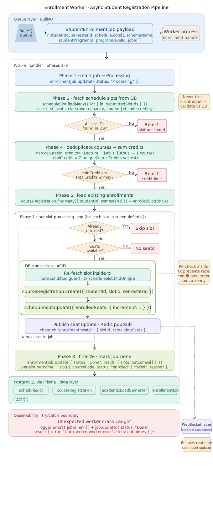

# Student Enrollment Worker

The Enrollment Worker is an asynchronous background processor built with BullMQ and Prisma. It handles student course registration requests, ensuring data consistency, enforcing academic rules, and providing real-time updates to the system.

## Workflow Overview

The worker follows a strict sequence of validation and execution steps to process enrollment requests:

1.  **Job Initiation**: Marks the job status as `Processing` in the database to provide feedback to the student/UI.
2.  **Data Retrieval & Integrity Check**: 
    *   Fetches the requested `scheduleSlots` directly from the database. 
    *   **Security**: Never trusts the client-provided slot data; it validates that all requested slot IDs actually exist.
3.  **Academic Load Validation**:
    *   Calculates the total credits of unique courses within the request.
    *   Fetches the `AcademicLoadSemester` configuration (min/max credits) for the student's current program, semester, and level.
    *   Ensures the requested load is within the allowed limits.
4.  **Duplicate Prevention**: Fetches the student's existing registrations for the current semester to ensure they aren't already enrolled in the requested slots.
5.  **Atomic Slot Processing**: For each valid slot, the worker:
    *   Performs a fast preliminary seat check.
    *   **Database Transaction**: Executes a transaction to:
        *   Perform a "fresh" seat availability check (critical for handling concurrent requests).
        *   Create the `courseRegistration` record.
        *   Increment the `enrolledSeats` count in the `scheduleSlot` table.
    *   **Real-time Synchronization**: Publishes a `enrollment:seats` event to Redis Pub/Sub, which the WebSocket layer uses to broadcast remaining seats to all connected clients.
6.  **Job Completion**: Updates the job status to `Done` and saves the detailed outcome (success/failure reason) for every slot processed.

## Key Features

*   **Concurrency Safety**: Uses database transactions and re-verification logic to prevent overbooking, even when hundreds of students attempt to enroll in the same slot simultaneously.
*   **Academic Rule Enforcement**: Automatically validates credit limits based on student progress and semester configuration.
*   **Real-time Seat Updates**: Integrates with Redis Pub/Sub to ensure the UI reflects seat availability changes immediately.
*   **Resilience**: Gracefully handles partial failures (e.g., if one slot is full but others are available) and records detailed error reasons for student troubleshooting.

## Technical Details

### Input: `EnrollmentJobMessage`
Contains student identifiers, schema context, and the list of requested schedule slots.

### Output: `EnrollmentJob` Result
A JSON object stored in the database containing:
*   `status`: The final state of the job (`Done`).
*   `slots`: An array of `SlotOutcome` objects indicating success or failure for each requested course.
*   `error`: Global error message if the entire job failed (e.g., academic load violation).

## Full Picture

```txt
                                              ┌──────────────────────┐
                                              │   Client / API       │
                                              │  POST /enroll        │
                                              └─────────┬────────────┘
                                                        │
                                                        ▼
                                              ┌──────────────────────┐
                                              │   API Layer          │
                                              │  (Express Controller)│
                                              └─────────┬────────────┘
                                                        │ enqueue job
                                                        ▼
                                              ┌──────────────────────┐
                                              │   BullMQ Queue       │
                                              │  (Enrollment Queue)  │
                                              └─────────┬────────────┘
                                                        │
                                                        ▼
                                              ┌────────────────────────────┐
                                              │   Worker (Consumer)        │
                                              │  - Validate credits        │
                                              │  - Atomic Transaction      │
                                              │  - Check seat availability │
                                              └─────────┬──────────────────┘
                                                        │
                                                        ▼
                                              ┌────────────────────────────┐
                                              │   Database (Prisma)        │
                                              │  - Enrollment table        │
                                              │  - Course capacity update  │
                                              └─────────┬──────────────────┘
                                                        │
                                                        ▼
                                              ┌────────────────────────────┐
                                              │   Redis Pub/Sub            │
                                              │  Publish Seat Update Event │
                                              └─────────┬──────────────────┘
                                                        │
                                                        ▼
                                              ┌────────────────────────────┐
                                              │   WebSocket Server         │
                                              │  Broadcast to clients      │
                                              └─────────┬──────────────────┘
                                                        │
                                                        ▼
                                              ┌────────────────────────────┐
                                              │   Connected Clients        │
                                              │  (Real-time UI updates)    │
                                              └────────────────────────────┘
```

## Enrollment Flow Diagram

The diagram below shows the full enrollment pipeline, including validation, transactional processing, and real-time seat synchronization.

