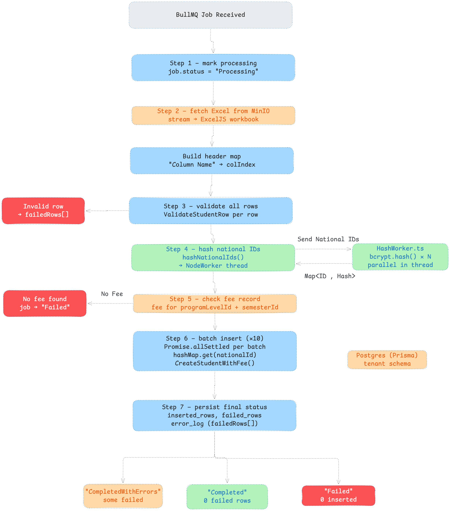

# Student Import Worker

The **Student Import Worker** is a specialized background service designed to handle bulk student data ingestion from Excel files. It provides an asynchronous, robust, and scalable solution for importing large datasets into the system while ensuring data integrity and providing detailed feedback to the user.

## The Core Idea
Processing large Excel files (potentially containing thousands of rows) is a resource-intensive task that can lead to timeouts and degraded performance if handled directly within the main API. 

This worker offloads that burden by using a **Queue-Worker pattern** (powered by BullMQ and Redis). When an import is initiated, the API simply stores the file in MinIO and queues a job. The worker then processes this job independently, allowing the system to remain responsive.

## Workflow Overview
1.  **Initialization**: Marks the job as `Processing` in the database.
2.  **Extraction**: Retrieves the Excel file from **MinIO** and parses it using **ExcelJS**.
3.  **Validation**: Iterates through rows, separating them into `validRows` and `failedRows` buckets based on predefined rules.
4.  **Hashing**: Pre-hashes all National IDs for valid rows to ensure security and consistency.
5.  **Prerequisite Verification**: Verifies that a valid fee record exists for the target program level and semester; otherwise, the job fails early to prevent inconsistent data.
6.  **Execution**: Processes valid rows in concurrent batches, attempting to create student records and associate them with their respective fees.
7.  **Finalization**: Updates the job status to `Completed`, `CompletedWithErrors`, or `Failed` and persists a detailed summary including an error log of all skipped rows.

---

# Student Import Worker Flow

